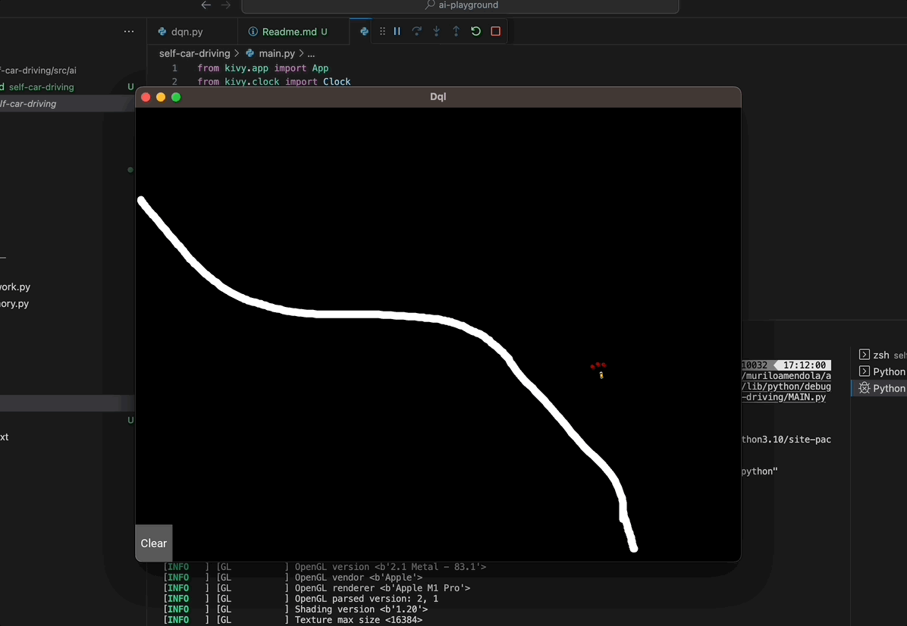

# AI Playground

Welcome to my AI Playground! This repository is dedicated to my various AI projects and experiments. Here, I explore the fascinating world of artificial intelligence, machine learning, and deep learning to create innovative solutions and learn from practical applications.

## Purpose

The primary purpose of this repository is for self-study and experimentation in the field of artificial intelligence. I use this space to:

- Showcase my AI projects and experiments.
- Share code and insights from my AI endeavors.
- Collaborate with the AI community and gather feedback.
- Continuously learn and improve my skills in AI and machine learning.

## Projects

### 1. Self-Driving Car

My first project in this AI Playground is the Self-Driving Car. In this project, I have implemented Deep Q-Learning to control a virtual car, enabling it to learn a path between two points and dodge obstacles. The graphical user interface is built with Kivy, making it easy to interact with and visualize the car's progress.

- [Self-Driving Car Project](./self-car-driving/Readme.md)

   

## Suggestions for next projects

- Intending to learn more about AWS SageMaker 

